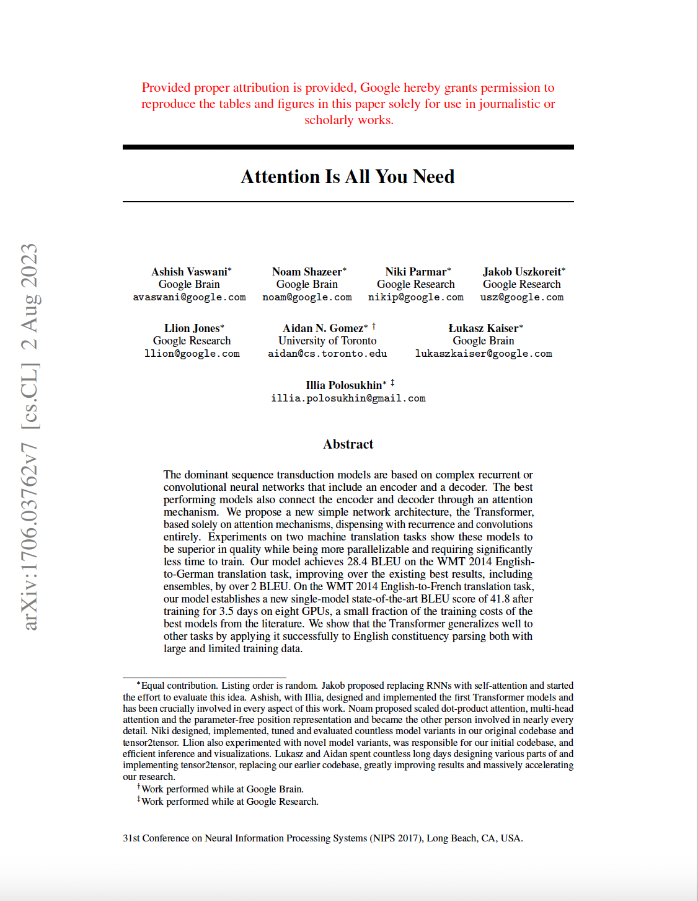
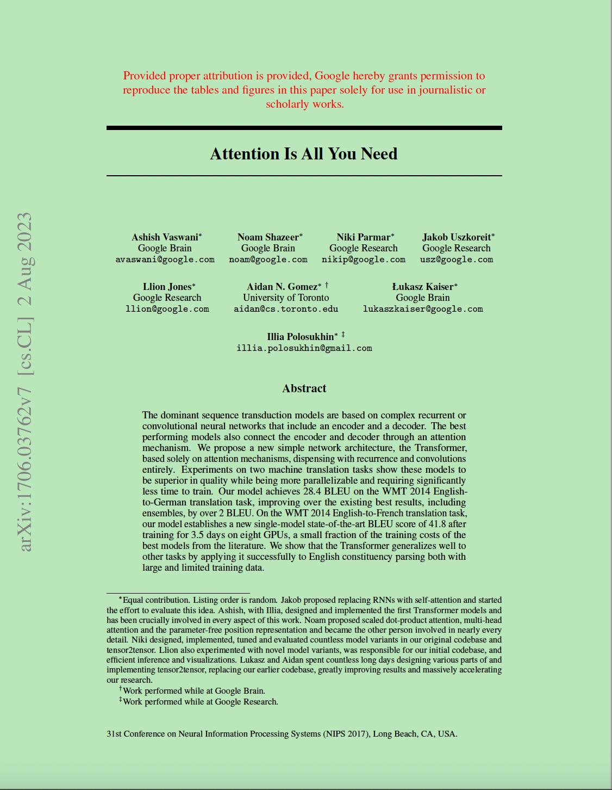

# visual-friendly-pdf

Reading papers with white background and black words for a long time is really harmful for your eyes and can even overfatigue your eyes. This tool can make your pdf looks more visual friendly, especially useful for paper reading.

Currently, it can convert the background color of a pdf file to green.


# Usage

First comfirm that you have install `PyMuPDF` library:

```bash
pip install PyMuPDF
```

Then use

```bash
python make_pdf_visual_friendly.py -i <input_pdf_filename> -o <output_pdf_filename>
```

to convert it.

# Example

Before converting:



After converting:


